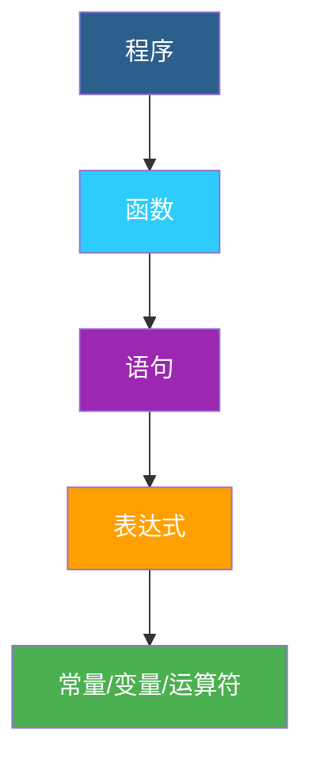
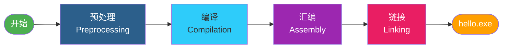

# 第1讲：表达式 —— C语言的灵魂

> **系列名称**：从程序员到架构师 —— C语言插件框架演进之旅
> **阶段**：01 / 12
> **预计学时**：45分钟
> **难度**：★☆☆☆☆

---

## 📚 本讲定位

> 一切伟大的建筑，都从一块砖开始。
> 一切伟大的框架，都从一个表达式开始。

这是我们整个系列的**起点**。但这不是一个普通的起点——我们要从 `printf("Hello, Plugin Framework!")` 这一行表达式里，读出C语言的设计哲学，读出软件架构的种子。

---

## 🎯 教学目标

| 维度 | 目标 |
|:---:|---|
| **知识** | 理解C语言表达式的本质；了解C语言诞生历史；掌握编译运行基本流程 |
| **能力** | 能独立编写、编译、运行简单C程序；能用UML活动图描述编译流程 |
| **素养** | 建立"进化思维"和"第一性原理"思维——从最基础的概念理解复杂系统 |

---

## 🌟 教学重点与难点

| ★ 教学重点 | ⚠ 教学难点 |
|:---|:---|
| 表达式的概念与C语言表达式的特点 | 为什么"几乎一切都是表达式"是C的核心设计 |
| C语言的诞生历史与历史地位 | 表达式 → 语句 → 函数 → 程序 的层次关系 |
| 编译运行的基本流程 | printf 背后的"接口"思想 |

---

## 📖 教学内容

### 一、导入：C语言是怎么来的？（8分钟）

#### 1.1 一个"副产品"改变了世界

时间回到 **1972年**，美国新泽西州，贝尔实验室。

有个叫 **Dennis Ritchie**（丹尼斯·里奇）的程序员，他和同事 Ken Thompson 正在搞一个叫 **UNIX** 的操作系统。当时 UNIX 是用汇编语言写的——没错，就是那种直接和机器对话、写起来像天书的语言。

写着写着他们受不了了："用汇编写操作系统，这是人干的事吗？"

于是 Ken Thompson 先搞了个 B 语言（BCPL 的简化版），但 B 语言太弱，不给力。Dennis Ritchie 就在 B 的基础上改改改，加了数据类型、加了指针、加了结构体……

**C语言就这样诞生了。**

> 🎯 **冷知识**：C语言为什么叫C？因为它的前身是B语言（BCPL的第一个字母），C是B的下一个字母。程序员起名字就是这么朴实无华。

#### 1.2 C语言为什么伟大？

C语言不是第一个高级语言，但它是第一个**"高级得恰到好处"**的语言。

| 语言类型 | 优点 | 缺点 | 代表 |
|:---|:---|:---|:---|
| 汇编语言 | 最快、最直接 | 难写、难读、不可移植 | 汇编 |
| C语言 | 接近机器效率，又有人类可读性 | 需要手动管理内存 | C |
| 高级语言 | 好写、好读、功能强 | 运行效率低、离硬件远 | Python/Java |

C语言就像一把**瑞士军刀**——它足够底层，让你能操控内存、操控硬件；它又足够高级，让你不用天天和 0101 打交道。

正因为如此：
- 🏆 **UNIX/Linux** 是用C写的
- 🏆 **Windows内核** 主要是C写的
- 🏆 **MySQL、SQLite、Redis** 是C写的
- 🏆 **Python、Ruby、PHP** 的解释器是C写的
- 🏆 几乎所有**嵌入式系统**都用C

> 💡 **一句话总结**：C语言是现代软件世界的地基。你现在用的几乎所有软件，往下挖几层，总能挖到C语言。

---

### 二、传统讲授：表达式 —— C语言的灵魂（12分钟）

#### 2.1 什么是表达式？

**表达式（Expression）= 能算出值的代码片段。**

听起来很简单？但这是C语言最核心的设计思想——**几乎一切都是表达式**。

来看看我们的主角：

```c
printf("Hello, Plugin Framework!\n");
```

这一行里藏着好几个表达式：

```
┌───────────────────────────────────────────────────┐
│  printf("Hello, Plugin Framework!\n")              │  ← 函数调用表达式
│          └──────────────────────┘                   │
│             字符串常量表达式                          │
└───────────────────────────────────────────────────┘
```

| 表达式类型 | 例子 | 值是什么？ |
|:---|:---|:---|
| 常量表达式 | `42`、`"Hello"` | 就是它本身的值 |
| 函数调用表达式 | `printf("Hi")` | 函数的返回值（printf返回打印的字符数） |
| 算术表达式 | `1 + 2 * 3` | 计算结果（7） |
| 赋值表达式 | `a = 5` | 被赋的值（5） |
| 逗号表达式 | `a=1, b=2, c=3` | 最后一个表达式的值（3） |

> 🎭 **幽默时间**：C语言的表达式有多疯狂？连 `a = b = c = 5` 这种写法都是合法的——因为赋值是表达式，有返回值，所以可以连锁赋值。别的语言："赋值就是语句。" C语言："不，赋值也是表达式，我就是要玩出花来。"

#### 2.2 表达式 → 语句 → 函数 → 程序

C程序的结构是一层层的：



| 层次 | 说明 | 例子 |
|:---:|:---|:---|
| **表达式** | 有值的代码片段 | `1 + 2`、`printf("Hi")` |
| **语句** | 程序执行的基本单位，表达式加分号就是语句 | `printf("Hi");` |
| **函数** | 多条语句的封装，有名字，可以被调用 | `int main() { ... }` |
| **程序** | 一个或多个函数组成的完整可执行体 | hello.exe |

> 💡 **关键洞察**：表达式是最底层的砖块。砖块虽小，但组合方式对了，就能盖出摩天大楼。我们这个系列，就是看这些"砖块"怎么一步步变成"框架"这座大厦的。

#### 2.3 我们的第一行代码

```c
#include <stdio.h>

int main(void)
{
    printf("Hello, Plugin Framework!\n");
    return 0;
}
```

逐行解读：

| 代码 | 含义 | 表情 |
|:---|:---|:---:|
| `#include <stdio.h>` | 把标准输入输出头文件"抄"进来，告诉编译器printf长啥样 | 📋 |
| `int main(void)` | 主函数，程序从这里开始执行。int表示返回整数，void表示不接收参数 | 🚪 |
| `printf("...");` | 调用printf函数，打印字符串。这是一个函数调用表达式 + 分号 = 语句 | 🖨️ |
| `return 0;` | 返回0，表示"我执行完了，一切正常" | ✅ |

#### 2.4 编译运行流程（UML活动图）

当你敲下 `gcc hello.c -o hello.exe` 时，发生了什么？



每个阶段做了什么：

| 阶段 | 做什么 | 输入 | 输出 |
|:---:|:---|:---|:---|
| 预处理 | 展开#include、#define等宏 | hello.c | hello.i |
| 编译 | 翻译成汇编代码 | hello.i | hello.s |
| 汇编 | 生成机器码（目标文件） | hello.s | hello.o |
| 链接 | 把printf的实现拼进来 | hello.o + stdio库 | hello.exe |

> 🎯 **重点中的重点**：你写的代码里没有printf的实现，但程序能运行。因为**链接器**把标准库里的printf和你的代码"接"在了一起。
>
> 这就是**复用**的起点——用别人写好的代码，做自己的事情。
>
> 这也是**接口**的起点——你不需要知道printf内部怎么实现，只需要知道"传什么参数、得到什么效果"。

---

### 三、AI化辅助：用AI探索表达式的奥秘（12分钟）

#### 3.1 AI演示：表达式的脑洞

**Prompt 示例**：

```
我是大三计算机专业学生，刚学完C语言基础。
请给我讲讲C语言中"表达式"这个概念的独特之处。
比如：为什么说C语言"几乎一切都是表达式"？
这和Java、Python等语言有什么不同？
举3个C语言表达式的"骚操作"例子。
```

**AI输出（示例）**：

> C语言的表达式确实是它的灵魂，这也是C被称为"表达式语言"的原因。
>
> **和其他语言的区别**：
> - Java/Python 把"语句"和"表达式"分得很清——赋值是语句，不能随便嵌在别的地方
> - C语言几乎"万物皆表达式"——赋值、函数调用、甚至逗号都是表达式
>
> **三个"骚操作"例子**：
>
> 1. **连锁赋值**：`a = b = c = 5;` 因为赋值表达式的值就是被赋的值，所以可以从右往左一路赋过去。
>
> 2. **赋值写在if里**：`if ((p = malloc(100)) != NULL) { ... }` 边赋值边判断，一行搞定。别的语言通常不让这么写。
>
> 3. **逗号表达式**：`for (i=0, j=10; i<j; i++, j--)` 逗号让你在一个地方写多个表达式，取最后一个的值。for循环里到处都是。
>
> 这种设计的好处是灵活，坏处是……太灵活了，容易写出让人看不懂的"天书"。

#### 3.2 核验练习：真的假的？

**任务**：把上面三个"骚操作"分别写成小程序，编译运行，验证AI说的对不对。

```c
// 实验1：连锁赋值
#include <stdio.h>
int main() {
    int a, b, c;
    a = b = c = 5;
    printf("a=%d, b=%d, c=%d\n", a, b, c);
    return 0;
}
```

> 📝 **AI核验四件套**
> - Prompt：（上面的Prompt）
> - AI输出：（上面的解释+三个例子）
> - 人工核验：编译运行三个例子，确认全部正确
> - 补充思考：灵活≠好。C语言的灵活性既是优点也是缺点——你怎么看？

#### 3.3 拓展：C语言的"亲戚"们

**提问**：C语言影响了哪些后来的语言？

> C语言是编程语言界的"老祖宗"之一。C++、Java、C#、JavaScript、Python、Go……几乎所有主流语言都受过C的影响。
>
> 为什么？因为C证明了：**一个好的语言设计，能定义一个时代的编程范式**。
>
> 而我们这个系列，就是要理解这个范式是怎么一步步从"表达式"生长成"框架"的。

---

### 四、做中学：动手实验（13分钟）

#### 实验1：亲手打出第一行代码

**任务**：不要复制粘贴，亲手敲出完整的hello.c，编译运行。

```
目标：输出 "我的第一个C程序！"
```

**观察**：你打错了几次？编译器报了什么错？你是怎么修好的？

> 💡 别小看"敲代码"这件事——手敲和复制粘贴，学习效果天差地别。程序员的手感，就是一行行敲出来的。

#### 实验2：表达式"套娃"

**任务**：试试把 printf 嵌套起来——printf的返回值是打印的字符数，我们把它打印出来看看。

```c
#include <stdio.h>
int main() {
    int n = printf("Hello\n");
    printf("刚才打印了 %d 个字符\n", n);
    return 0;
}
```

**思考**：
- printf 居然有返回值？你之前注意到了吗？
- 返回值是6还是7？换行符 \n 算一个字符吗？
- 这说明了什么？（printf 是一个表达式，有值！）

#### 实验3：故意制造错误

**任务**：至少尝试3种错误写法，记录编译器的报错信息。

| 错误类型 | 编译器报了什么 | 你能看懂吗？ |
|:---|:---|:---|
| 漏掉分号 | | |
| 拼错 printf | | |
| 删掉 #include | | |

**思考**：编译器的错误信息对你有帮助吗？如果你是编译器设计师，你会怎么改进报错提示？

---

## 🔄 进化视角

### 本阶段的"种子"

虽然我们现在只有一个表达式，但这里面已经藏着软件架构的全部基因：

| 种子 | 对应未来的概念 | 出现阶段 |
|:---|:---|:---:|
| 表达式可以组合嵌套 | 模块化组合思想 | 贯穿始终 |
| 调用别人写好的函数（printf） | **接口** —— 定义契约，隐藏实现 | 第7阶段 |
| 编译器把源码变成可执行文件 | 编译与链接的桥梁作用 | 第4-6阶段 |
| 标准库提供通用功能 | **库** —— 二进制级别的复用 | 第4-5阶段 |
| main函数是固定入口点 | **控制反转** —— 框架调用你的代码 | 第9阶段 |

### 本阶段的痛点

```
😫 所有代码都写在一个main函数里
   代码多了之后，main函数会变成"屎山"
```

**下一阶段（02_函数封装）**：把代码拆分成函数，让main函数保持清爽。

---

## 📝 课堂小结

| 知识点 | 要点 |
|:---|:---|
| C语言历史 | 1972年，Dennis Ritchie，贝尔实验室，UNIX的副产品 |
| 表达式 | C语言的灵魂——几乎一切都是表达式，都有值 |
| 程序层次 | 表达式 → 语句 → 函数 → 程序（从小到大） |
| 编译四步 | 预处理 → 编译 → 汇编 → 链接 |
| 接口思想 | 调用者不需要知道实现，只需要知道怎么用 |
| 进化思维 | 每一个技术都是为了解决前一阶段的痛点 |

---

## 📚 课后任务

1. **必做**：完成3个实验，记录错误和修复过程
2. **选做**：用 AI 查一下"Dennis Ritchie 和 C语言的故事"，写300字感想
3. **预习**：如果main函数里有100行代码，会有什么问题？怎么解决？

---

## 🤔 思考题

> 详见 [思考题.md](../思考题.md)（共4道思辨题）

---

*下一讲：[02_函数封装](../02_函数封装/) —— 把代码组织成函数，告别"屎山"main*
